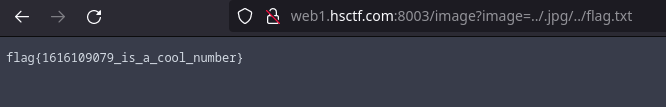

*A simple web challenge involving directory traversal.*

<!--more-->

### Description
> Look at these images I found!
>
> Points: 201
>
> Solves: 303
>
> URL: [http://web1.hsctf.com:8003/](http://web1.hsctf.com:8003/)
>
> Additional attachments: [Download](https://hsctf-9-resources.storage.googleapis.com/uploads/f6fb4242f208ee8229bac9fb310223ea685530b2d72582eec086a1988acdf26a/gallery.zip)

### Solution

I believed it was a steganography challenge at first, so I wgetted all of the images on the site and then ran exiftool, but I came back with absolutely nothing.

Until on closer inspection at the gallery page, I noticed that the image url had /image?image= and I immediately knew it could be exploited as a path traversal attack due to the images being embedded through the image parameter instead of directly embedding the file (which is more secure than that lol).

I looked at the [source code](https://hsctf-9-resources.storage.googleapis.com/uploads/f6fb4242f208ee8229bac9fb310223ea685530b2d72582eec086a1988acdf26a/gallery.zip) and noticed this route

```python
@app.route("/flag")
def flag():
	if 2 + 2 == 5:
		return send_file("/flag.txt")
	else:
		return "No.", 400
```

This was a clear indication of where the flag is located, but there were a few checks I had to go through.

```python
@app.route("/image")
def image():
	if "image" not in request.args:
		return "Image not provided", 400
	if ".jpg" not in request.args["image"]:
		return "Invalid filename", 400

	file = IMAGE_FOLDER.joinpath(Path(request.args["image"]))
	if not file.is_relative_to(IMAGE_FOLDER):
		return "Invalid filename", 400

	try:
		return send_file(file.resolve())
	except FileNotFoundError:
		return "File does not exist", 400
```

So according to these checks it had to be a .jpg and had to be relative to the directory where the images are located. After seeing the directory relativity check I knew that it could be bypassed with a ../ and so that became apart of my payload as
> ../flag.txt

Now I needed a way to bypass the .jpg check, at first I tried ideas like
> ../flag.txt.jpg

with a null character in between .txt and .jpg, but that clearly didn't work. Until I looked back at the source code and it hit me, the .jpg didnt have to be at the end of the file, all it needed was to be inside the request parameter, so I crafted
> ../.jpg/../flag.txt

and voilà, I have the flag.


