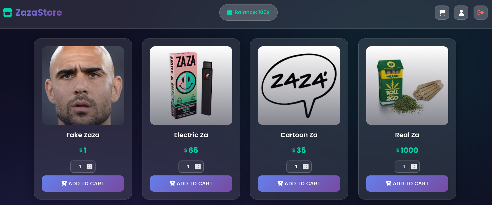
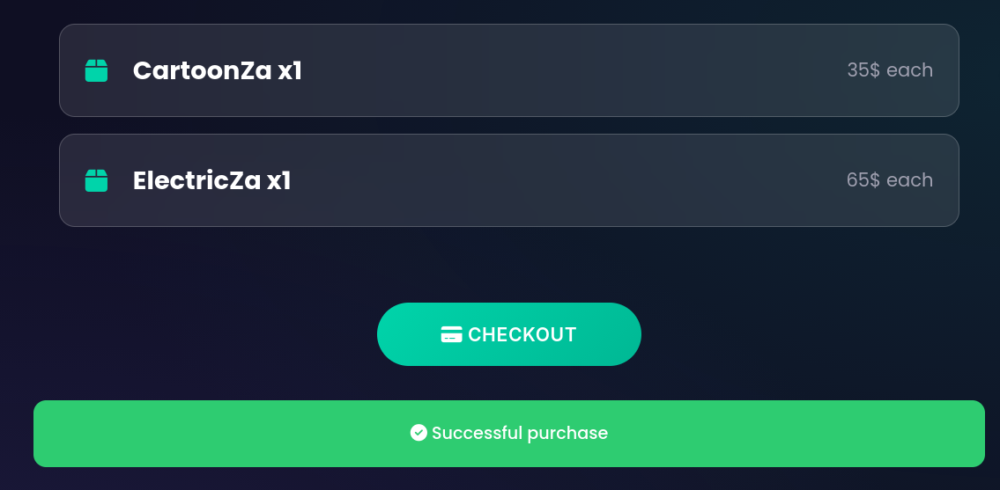
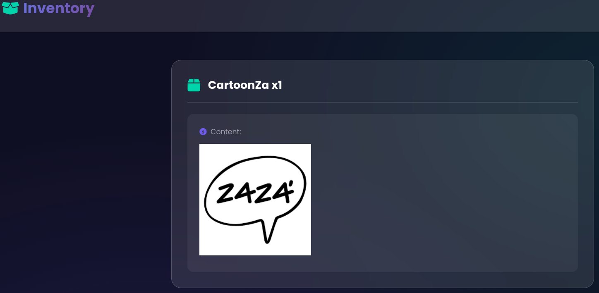
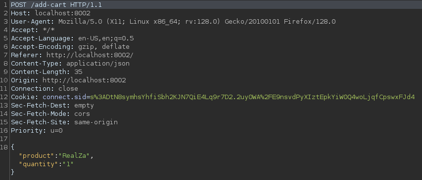
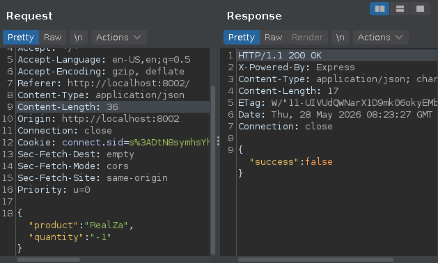
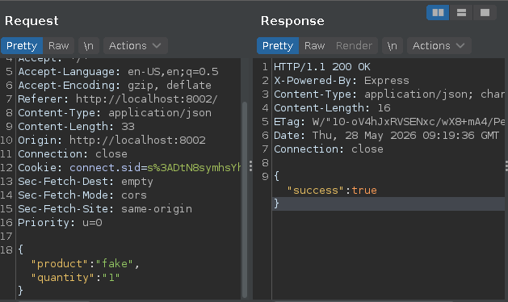
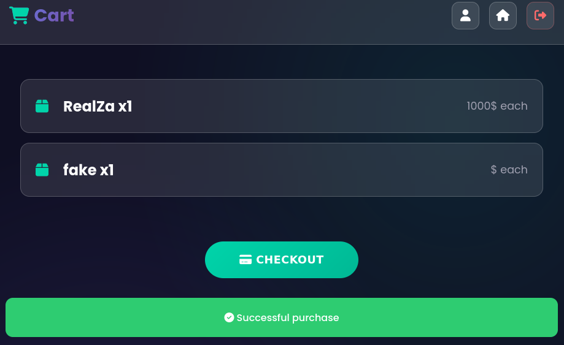
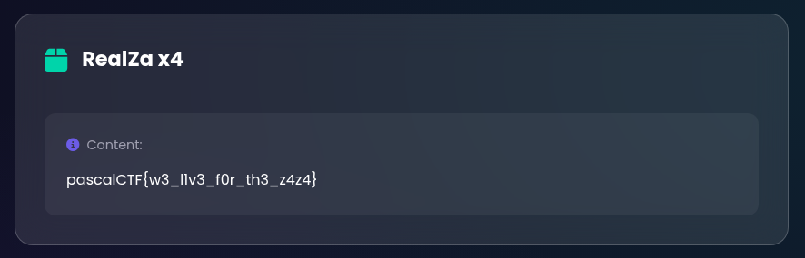

## Challenge Description
`We dont take any responsibility in any damage that our product may cause to the user's health`

## Introduction
"Zazastore" was a web challenge in PascalCTF 2026. While being a rather easy challenge, it did
showcase a couple of pitfalls in regards to backend design choices and how language quirks can
cause unforseen vulnerabilities if not properly tested.

A [handout](https://github.com/PascalCTF/PascalCTF-2026/tree/main/web02) containing the backend
source code was provided, but I prefer to have a look at the application in a black box setting
to see what it's meant to do, before I review the code to see how it is accomplished.

## Black Box Enumeration
Upon entering the challenge you land on a login page. I tried a basic `admin' OR 1=1--` SQLi, and
was taken to the main page, but with no admin panel in sight. Suspecting this might just be broken
authentication rather than a successful injection, I logged out and tried random credentials -
which also worked, confirming the login accepts anything.


The main page of the application is a store front with some products. I have 100 credits available
in my balance, and can afford all but one products, "RealZa"; buying this product is likely the
goal of the challenge.



Adding a couple of the products to the basket and checking out reduced the credits by the correct
amount and placed the purchased products in my inventory.






Using Burpsuite I captured a request to add a product to the cart to see the format, a json object
containing the name of the product and the quantity.




I then attempted to modify the request to see if it is possible to add a negative quantity in
order to "sell" items to the store, thereby increasing the balance and being able to afford
buying the suspected flag, which did not work.




With the normal flow understood and one boundary tested, reviewing the provided source code reveals
the negative quantity check - and what was missed alongside it.

## Source Code Review
Looking at the code for the server, the first thing that sticks out is that the product prices
are stored as key/value pairs in an object. There is no database, which means no explicit handling
of queries returning null/empty or raising of errors for missing keys.
```JavaScript
const prices = { "FakeZa": 1, "ElectricZa": 65, "CartoonZa": 35, "RealZa": 1000 };
```

Next, there's the login. We could log in using any combination of username and password, and here
we can see why; the login just checks if the user has submitted anything at all for both fields
and if so, proceeds to grant 100 credits and creates an authenticated session.
```JavaScript
app.post('/login', (req, res) => {
    const { username, password } = req.body;
    if (username && password) {
        req.session.user = true;
        req.session.balance = 100;
        req.session.inventory = {};
        req.session.cart = {};
        return res.json({ success: true });
    } else {
        res.json({ success: false });
    }
});
```

The add-cart function is where things start to get interesting though. After making sure that
there's a cart for the session, the function gets the product name and quantity from the
request body. The only attempt at actually validating the data sent from the client is to check
that the quantity is not below 1, but as long as it is then the product name string is just
added to the cart as a key, along with the quantity as its value, and if the key already exists
increase the quantity value.
```JavaScript
app.post('/add-cart', (req, res) => {
    const product = req.body;
    if (!req.session.cart) {
        req.session.cart = {};
    }
    const cart = req.session.cart;
    if ("product" in product) {
        const prod = product.product;
        const quantity = product.quantity || 1;
        if (quantity < 1) {
            return res.json({ success: false });
        }
        if (prod in cart) {
            cart[prod] += quantity;
        } else {
            cart[prod] = quantity;
        }
        req.session.cart = cart;
        return res.json({ success: true });
    }
    res.json({ success: false });
});
```

Missing server side validation of client input is a major finding. It is good that it makes sure
that the quantity is a positive integer, as it prevents abuse where a user could increase their
balance by "buying" a negative quantity of items, but as for the product itself, we can send
whatever product name we want, and the server just accepts it.

The next interesting bit to look at is the checkout function:
```JavaScript
app.post('/checkout', (req, res) => {
    if (!req.session.inventory) {
        req.session.inventory = {};
    }
    if (!req.session.cart) {
        req.session.cart = {};
    }
    const inventory = req.session.inventory;
    const cart = req.session.cart;

    let total = 0;
    for (const product in cart) {
        total += prices[product] * cart[product];
    }

    if (total > req.session.balance) {
        res.json({ "success": true, "balance": "Insufficient Balance" });
    } else {
        req.session.balance -= total;
        for (const property in cart) {
            if (inventory.hasOwnProperty(property)) {
                inventory[property] += cart[property];
            }
            else {
                inventory[property] = cart[property];
            }
        }
        req.session.cart = {};
        req.session.inventory = inventory;
        res.json({ "success": true });
    }
});
```

Here we can see that the price lookup and calculating total price is done in a simple for-loop.
```JavaScript
    for (const product in cart) {
        total += prices[product] * cart[product];
    }
```
Again, this is entirely without validation or error handling; the loop simply tries to lookup the
price for the product by using the string as a key to fetch a value from the prices object, but
what happens if the product doesn't exist?

## The Exploit
With the vulnerability chain mapped, exploiting it is straightforward; all that needs to be
done is intercepting a request to add an item to the cart and modify the name of the product to
anything that isn't in the store,



make sure that the cart contains both the fake item and the flag ("RealZa"), and then proceed to
check out.



After checking out the items, the flag is available in the inventory.




In fact, you don't even need to use a proxy for the exploit; replaying the request can be done
in the browsers developer tools (Ctrl+Shift+I).

## Why The Exploit Works
Unlike strongly typed languages, where `prices["fake"]` would throw an exception or fail to
compile, forcing the developer to handle the case explicitly, JavaScript instead returns
`undefined` when the lookup fails.

This behavior is part of JavaScript's permissive dynamic type system and object model, where
accessing a non-existent property does not raise an exception by default, allowing the script to
continue execution instead of halting due to an unhandled exception.

When the `undefined` value is then used in the loop calculating the total price, JavaScript
implicitly coerces it into NaN, which propagates to total becoming NaN. Even adding more items
can not recover this, as the expression always becomes `NaN + number = NaN`.

The condition that completes the exploit is the fail-open design of the balance check, where if the total
exceeds the current balance the function returns "Insufficient Balance". If this condition fails
then the purchase is completed, and because any comparison between NaN and a number always
evaluates as false, this is what happens.

In short, the exploit works because three independent permissive behaviors compound:
a missing validation, silent type coercion, and a fail-open condition.
Any one of them fixed breaks the chain.

## Remediation
To remediate the exploited vulnerabilities the server needs to validate the data sent by the client
to ensure that the product added to the cart actually exists, and the checkout process should be
changed to a fail-closed design that only succeeds when the correct conditions are met, and
fails when they are not.

This design is preferable, because it is both easier to model the single condition required to
proceed rather than to anticipate every condition that should be blocked - unexpected inputs will
always find gaps in a blocklist, but fail to meet an explicit success condition.

### Rejecting unknown products
Looking first at the /add-cart functions, the addition of a simple check to see if the product
that is being added exists in the products object prevents our exploit.
```JavaScript
if (!(prod in prices)) {
    return res.json({ success: false });
}
```

### Fail-Open vs. Fail-Closed Design
The current design, where only a specific condition prevents the purchase from proceeding has the
form of this fail-open design (simplified):
```JavaScript
if (total > req.session.balance) { fail } else { succeed }
```

A more secure design choice would be to specify the condition to proceed, and block all other
cases (simplified:)
```JavaScript
if (total <= req.session.balance && !isNaN(total) && total > 0) {
    succeed
} else {
    fail
}
```

## Lessons
If either of the suggested changes had been implemented, our exploit would not have worked; it is
still preferable to implement both changes, as they would provide a better defense in depth.

It is often not a single vulnerability that leads to an exploit, but rather multiple that line up.
Trying to secure an application, a host OS, or a network, in multiple layers is essential,
especially as it/they expand over time and new vulnerabilities may be introduced.
Multiple layers of security checks can prevent newly introduced vulnerabilities from being
exploited, because existing defenses may already break the new attack chain.
